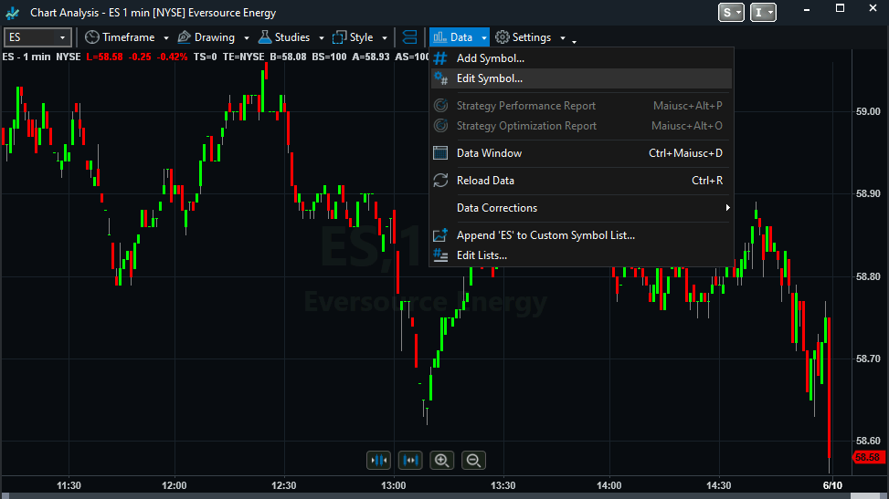
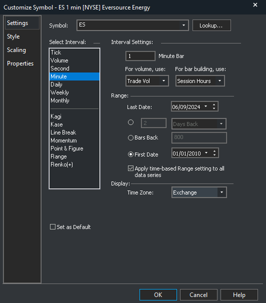
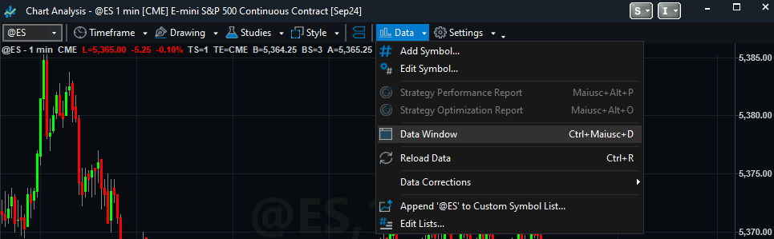
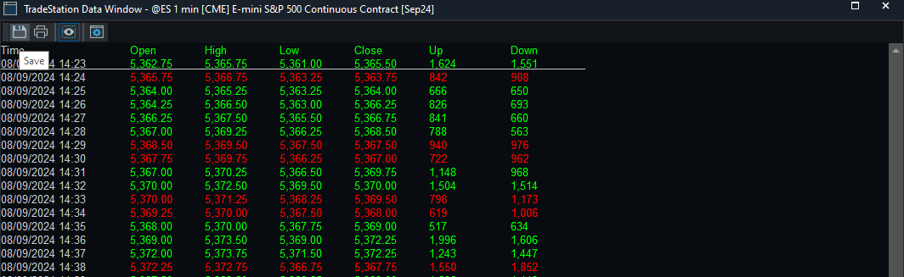

## Downloading data from Tradestation

From the top menu, select `File -> New application -> Chart analysis`. On the chart window that will appear, click the 
`Data` button and select `Reload data` from the menu that will appear to reload data for continuous contracts.
Then, from the same menu select `Edit symbol` , as shown in the image below:

A dialog will appear. Selecting the `Settings` entry on the left panel, the panel below will show up:

Make sure to set/change:
- **Symbol**: whatever you want
- **Interval**: Minute
- **Minute bar**: 1
- **First date**: 01/01/2010
- **Timezone**: exchange

Then, click the `Save` button to exit the dialog. At this point, we have to export the data, so click again the
`Data` button and then `Data window`, as shown in the image below:

The data window will appear (see image below). The final step is to press the `Save` and select a name to give to the file
(it is a good practice to use the `.csv` suffix as data files are Comma Separated Values files).

